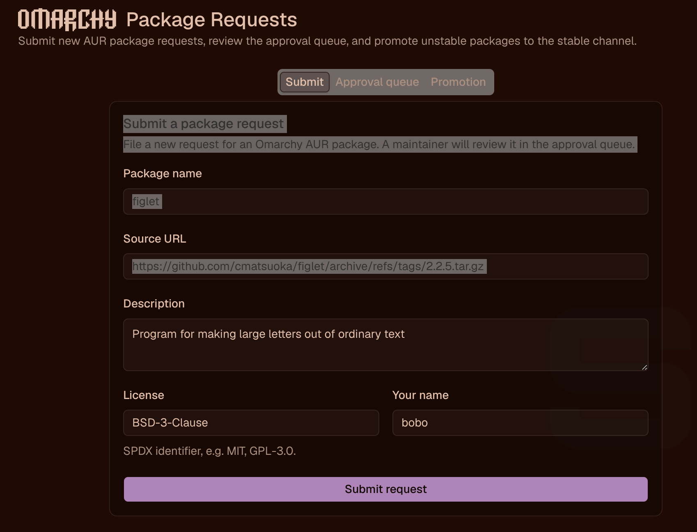
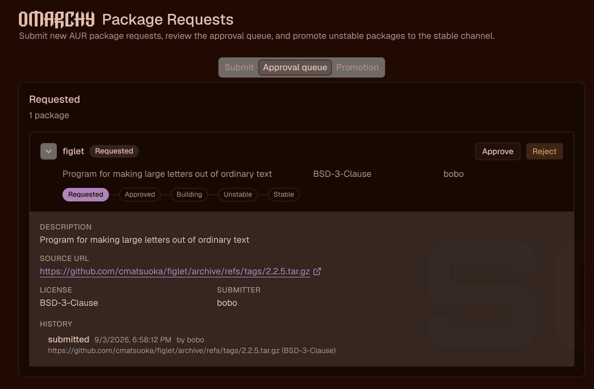
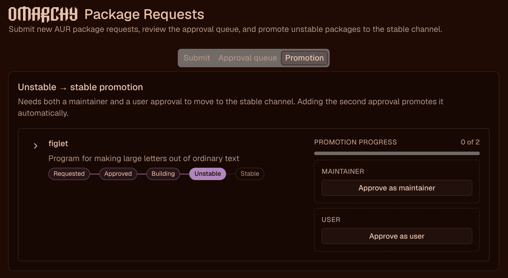

# Omarchy AUR Factory

This is a research spike of an Omarchy AUR package factory. The goal is:

1) A user submits a request for a package, which results in a packaging request
2) A maintainer approves the request
3) A software factory creates the new package, lints, tests, and builds it
4) The software factory records the package is complete and publishes it to an unstable channel
5) A maintainer and a user both approve the package is working
6) The package is moved to a stable channel

It's working end to end, making isolated package builds from minimal, controlled user input.

# Getting started

First, install [swamp](https://swamp-club.com)

```
curl -fsSL https://swamp-club.com/install.sh | sh
```

Then clone this repo:

```
git clone git@github.com:adamhjk/omarchy-aur-factory.git
```

Then run the setup script:

```
./setup.sh
```

This will make sure your machine has an isolated build rootfs,
install the deps for the web app, and makes sure all the
prerequisites are installed.

Setup is idempotent, so you can run it again if you need: it
bootstraps the isolated build rootfs (user namespaces — no sudo, no containers
to install), installs the web app's dependencies, and probes every prerequisite
with real operations. Anything it cannot fix without privileges (base-devel,
pacman-contrib, nodejs/npm, the claude CLI, a missing /etc/subuid entry) is
reported as `missing` with the exact remediation command. Re-run until it
reports `passed` with nothing missing; `./setup.sh --deep` additionally builds
and vets the generated seed package end-to-end.

Then start the web UI:

```
./run.sh
```

Open http://localhost:3000. To reach it from elsewhere on a network you
trust: `HOST=0.0.0.0 ./run.sh`.

# Example inputs

## Package requests (via the web app's Submit tab, or the CLI)

Known-good starters, each proven through this factory:

| pkgname | url | description | license |
|---|---|---|---|
| figlet | https://github.com/cmatsuoka/figlet/archive/refs/tags/2.2.5.tar.gz | Program for making large letters out of ordinary text | BSD-3-Clause |
| entr | https://github.com/eradman/entr/archive/refs/tags/5.8.tar.gz | Run arbitrary commands when files change | ISC |
| shellharden | https://github.com/anordal/shellharden/archive/refs/tags/v4.3.2.tar.gz | Shell script hardening tool (Rust) | MPL-2.0 |
| htop | https://github.com/htop-dev/htop/archive/refs/tags/3.5.3.tar.gz | Interactive process viewer | GPL-2.0-only |
| lazygit | https://github.com/jesseduffield/lazygit/archive/refs/tags/v0.64.1.tar.gz | Simple terminal UI for git commands | MIT |

Hit the web interface, and then submit figlet:



Then go to the approval panel and approve it:



Give it a random username to approve it as.

If there is a problem, the build will fail, and you will be able to look at all the 
stages. Feed a hint for the next turn into the UI, and then retry the build with
your hints!

To "promote" the package, approve it as a maintainer and as a user:



Or run it from the CLI:

```
swamp workflow run create-package \
  --input pkgname=figlet \
  --input url=https://github.com/cmatsuoka/figlet/archive/refs/tags/2.2.5.tar.gz \
  --input "description=Program for making large letters out of ordinary text" \
  --input license=BSD-3-Clause \
  --input dir=$PWD/../test-packages/figlet \
  --input workdir=/tmp/omarchy-factory-scratch/figlet
```

Rebuild/vet an existing PKGBUILD:

```
swamp workflow run build-package \
  --input dir=$PWD/../test-packages/figlet --input name=figlet --input version=2.2.5-1
```

## Retry a failed build with maintainer hints

Some packages need a round or two — that is what the retry loop is for. lazygit
is the canonical exercise: its first build fails in check(). Watch it fail in
the Approval queue, expand the check phase to see the error, then hit Retry
(or `--input "hints=..."` on `create-package`) with the failure pasted in:

```
test failed with "must run in lazy project folder or child folder", figure it out
```

Hand the author the evidence and let it investigate — its analysis lands in the
next dossier's design rationale. Prescriptive hints also work when you already
know the answer (real ones from packaging swamp itself):

- "check() fails: the http networking test simulates connection resets and is
  unreliable under makepkg — exclude that one test file, keep the rest of check()."
- "Root cause confirmed: the test stub hardcodes /usr/bin/deno as a path that
  must not exist; patch it to /nonexistent/deno in prepare() and note the
  upstream bug."

## App work requests (software factory)

```
swamp workflow run update-app \
  --input appDir=$PWD/../app/omarchy-package-request \
  --input name=wi-010-example \
  --input "request=Add a package-count Badge to each tab label (e.g. 'Approval queue (3)'), derived from the already-fetched request list. No API changes. npm run test, typecheck and build must pass."
```

Be specific: name endpoints, data shapes, and the tests that must pass.

# Cautions

- Arch Linux only (makepkg/pacman are load-bearing). You need an authenticated
  `claude` CLI.
- PKGBUILDs are model-authored: read the dossier before you promote — that is
  what the maintainer/user promotion gates are for.
- The web app has no authentication and its API executes swamp commands: bind it
  to localhost or a trusted tailnet only.
